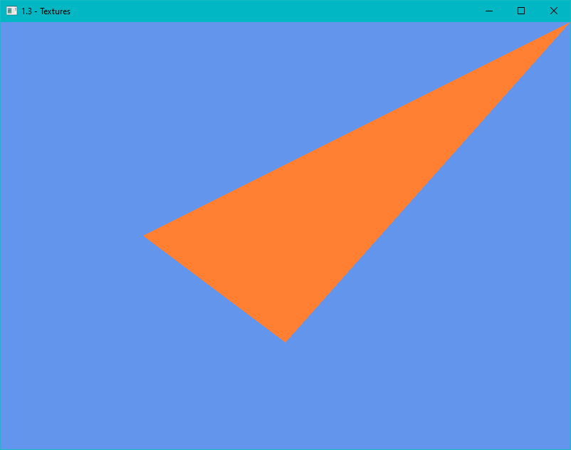
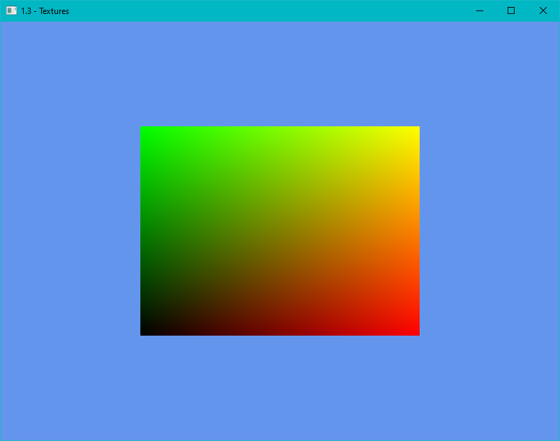
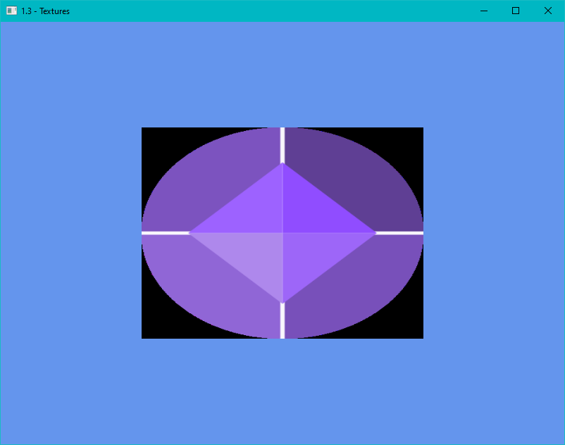
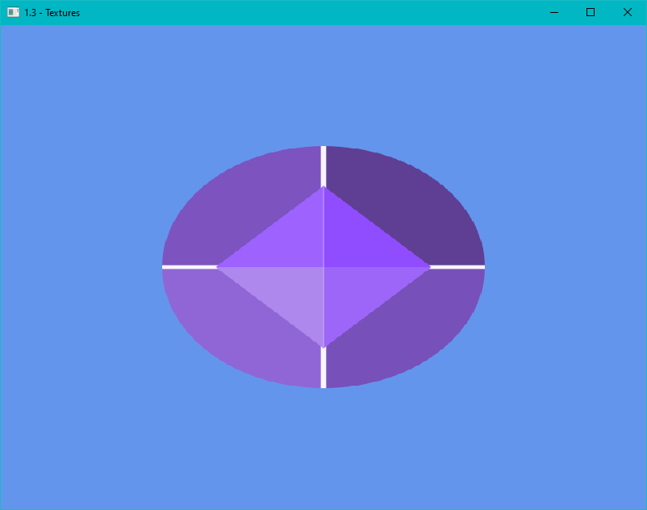
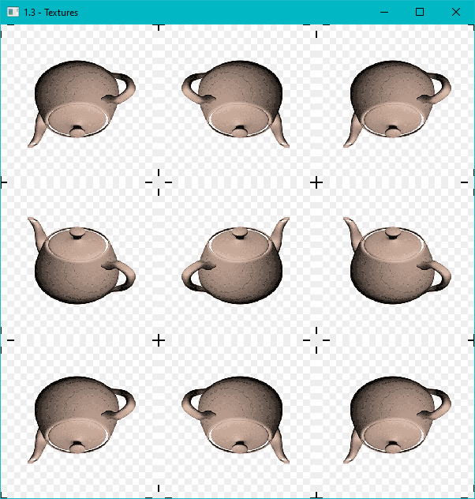
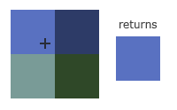

---
{
    "TableOfContents": {
        "Name": "1.3 - Hello Texture",
        "Url": "3-hello-texture.html",
        "Metadata": {
            "AuthorGitHub": "lumi2021",
            "DateTimeWritten": "11/01/2024 16:00",
            "PreviewImage": ""
        }
    }
}
---

# 1.3 - Hello Texture
<?# Info "You can view the source code for this tutorial [here](../sources/1.3-final-result.html). This tutorial builds on the previous tutorial. If you haven't read it, you can do so [here](1-hello-window.html)." /?>

In the previous tutorial, we've shown you how to open an OpenGL window and draw a colored quad.
                                                    
Another very important thing in graphics programming is the ability to draw images. In this tutorial, you'll learn:

* What a texture is.
* How to send more data to shaders.
* How to use texture coordinates.
* How to import images as textures.
* How shaders handle images.
* How OpenGL handles transparency.
* How to use texture parameters.
* What are mipmaps and how to use them.

## What a texture is
Textures are multidimensional objects that store color data.

The most common type of texture is a 2D texture, which stores the 2D grid of pixels that makes up an image. This is just for comparison though,
as texture objects are a lot more complex than just 2D arrays!
This data is stored in GPU memory, and can be read by a shader.

<?# Info "There are multiple different dimensions of texture from 1D through to 3D. For the purposes of this tutorial, we will be focusing on 2D." /?>

Textures are quite finicky to setup, and need quite a bit of information in order to be drawn.
The most important piece of information that we need to send to the texture to see it on the screen are the texture coordinates.
The texture coordinates are the positions within the texture for a particular vertex. Below we will learn how to fill out this data and read it from a shader.

## Sending more data to shaders
Texture coordinates are a type of data that can be manipulated by the vertex shader before it is used by the fragment shader.
This means that this data needs to be passed to the vertex shader which, as per the previous tutorials, is once again done using a vertex buffer.

Let's go back to our `OnLoad` function and update our `vertices` array to the following:
```cs
// The quad vertices data. Now with Texture coordinates!
float[] vertices =
{
//       aPosition     | aTexCoords
     0.5f,  0.5f, 0.0f,  1.0f, 1.0f,
     0.5f, -0.5f, 0.0f,  1.0f, 0.0f,
    -0.5f, -0.5f, 0.0f,  0.0f, 0.0f,
    -0.5f,  0.5f, 0.0f,  0.0f, 1.0f
};
```

With how we have structured the data, both the vertex and texture coordinates can be stored in a single array.

If we try to run our program now...



Well, that doesn't look like the quad we were expecting. This is because we have updated the vertex buffer we're passing to the vertex shader,
but haven't updated anything else such as our vertex layout definition. Luckily, it's very easy to modify the the example vertex layout
shown in the previous tutorial to work with our new texture coordinates.

In our `VertexAttribPointer` calls, we declared an `aPosition` attribute with a size of 3 floats and a stride of 12 bytes (`3 * sizeof(float)` equals 12).
Because of this, our buffer is being read like this:


As you can see, the vertex buffer is being read as if the first vertex was composed of the first three floats in the buffer, then the second
vertex the next three floats, the third vertex the next three, and so on and so forth. However, this is now wrong! Since each
vertex has two UV floats after its three position floats, this means that the first vertex's U and V floats are being read as the second
vertex X and Y position floats!


To fix this, we just need to go back to our `VertexAttribPointer()`, which is below our shader compiling section, and
change it to:
```cs
//                       3 floats for position + 2 floats for texture coordinates! \/
_gl.VertexAttribPointer(positionLoc, 3, VertexAttribPointerType.Float, false, 5 * sizeof(float), (void*)0);
```

This will make the buffer be read like this (including the texture coordinate pointer, which we'll add into our code later):


Now the positions of each vertex are being read correctly! Each position is still three floats, but by skipping the two floats after each position,
we skip over the U and V floats in between each XYZ floats, thus reading them correctly.

If we run the program now, we can see our quad again!

## Using texture coordinates
Now, we just need to prepare the shader to receive the texture coordinate values. For that, we need to modify both our shaders.

Vertex Shader:
```
#version 330 core

layout (location = 0) in vec3 aPosition;
// Add a new input attribute for the texture coordinates
layout (location = 1) in vec2 aTextureCoord;

// Add an output variable to pass the texture coordinate to the fragment shader
// This variable stores the data that we want to be received by the fragment
out vec2 frag_texCoords;

void main()
{
    gl_Position = vec4(aPosition, 1.0);
    // Assigin the texture coordinates without any modification to be recived in the fragment
    frag_texCoords = aTextureCoord;
}";
```
In this case, we are manually specifying the `location` of `aTextureCoord` as 1, because we already have an attribute in the location 0.


Fragment Shader:
```
#version 330 core

// Receive the input from the vertex shader in an attribute
in vec2 frag_texCoords;

out vec4 out_color;

void main()
{
    // This will allow us to see the texture coordinates in action!
    out_color = vec4(frag_texCoords.x, frag_texCoords.y, 0.0, 1.0);
}
```
As you already know, the Vertex Shader runs for every vertex of the mesh and the Fragment Shader runs for every pixel inside the mesh.
This conversion looks weird at first glance, but the data communication between vertex and fragment shader are surely possible because
OpenGL automatically interpolates the data outputted by the Vertex Shader when it's received by the Fragment Shader.

Now we just need to assign the correct layout for `aTextureCoord`. You should add these lines below our first `VertexAttribPointer` call:

```cs
const uint texCoordLoc = 1;
_gl.EnableVertexAttribArray(texCoordLoc);
_gl.VertexAttribPointer(texCoordLoc, 2, VertexAttribPointerType.Float, false, 5 * sizeof(float), (void*)(3 * sizeof(float)));
```
Here we're specifying a new vertex attribute, which consists of two floats and repeats every 20 bytes (`5 * sizeof(float)` = 20,
that's the size of one vertex).

Pay attention to the last parameter, the pointer! It represents the number of bytes by which the offset within the vertex buffer
should be incremented before reading the vertex attribute data. This means that for this attribute OpenGL will advance past first
3 floats (`3 * sizeof(float)`) worth of data (which are our vertex XYZ coordinates) and instead read the next 2 floats after that.

If you do everything right, you will see this result!



This gives us a nice visualisation of the texture coordinates, but it's not a textured quad. What exactly are we looking at?
What you are seeing is the texture coordinates we passed displayed as a color!

The Red, Green and mix between these two colors you see are, respectively, the X and Y texture coordinate values of that pixel.
In the shader, the values are being read like this:


As you can see, as the X/U coordinate increases so does the amount of red in the output pixel, and likewise as the Y/V coordinate increases so does the amount of green.
Even though we only specified UV values for each vertex, all pixels in the quad have UV values. That's because, as you read before,
the fragment shader interpolates the coordinates for us, saving us a lot of work on our end.
If we follow the diagonal from (0, 0) to (1, 1), the amount of red and green in the output color increases at the same rate, resulting in a yellow color.

## Importing images as textures
Now for the fun part: rendering an image!

To start this section, first download
[silk.png](https://github.com/dotnet/Silk.NET/blob/477154b99564aac9cf82426754857103fb88d2ea/examples/CSharp/OpenGL%20Tutorials/Tutorial%201.3%20-%20Textures/silk.png).
We will use this image in this tutorial!

In most cases with OpenGL, textures are uploaded as a sequence of bytes, this is usually done with a layout of 4 bytes per pixel (Red, Green, Blue, and Alpha).
The hard part is: we can't just upload the bytes of a `.png` or `.jpg` file! These formats have a lot of unnecessary data, like headers and, most importantly,
they're compressed, which the GPU generally cannot understand.

To load an image file as a byte array, we will first need an external library. In our case, we will use StbImageSharp.

First of all, install the library using NuGet. To do so, you can use your IDE's NuGet package manager,
or you can run the following command inside your project folder:
```
dotnet add package StbImageSharp
```

After installing, add the following reference on the top of your code file:
```cs
using StbImageSharp;
```

At the top of your class, declare a `uint` to store the ID of the OpenGL texture object:
```cs
private static uint _texture;
```

Returning to your `OnLoad` method, add these lines at the end of the method to create and bind the texture.
That `ActiveTexture` call is telling OpenGL that we are wanting to use the first texture unit.
```cs
_texture = _gl.GenTexture();
_gl.ActiveTexture(TextureUnit.Texture0);
_gl.BindTexture(TextureTarget.Texture2D, _texture);
```
<?# info "Texture units are locations in the OpenGL state where textures can be bound. Instead of textures being specified directly to shader samplers,
textures are bound to a texture unit, and the texture unit is then specified to the shader sampler." /?>

After that, we need to load the image. You can do it with the following line:
```cs
// ImageResult.FromMemory reads the bytes of the .png file and returns all its information!
ImageResult result = ImageResult.FromMemory(File.ReadAllBytes("silk.png"), ColorComponents.RedGreenBlueAlpha);
```

Now, with the image in memory, we need to upload the data to the GPU texture. To do that, we need a pointer for our bytes, the width, and the height of
the texture. None of it is hardcoded, you get all this information inside `ImageResult`.
```cs
// Define a pointer to the image data
fixed (byte* ptr = result.Data)
    // Here we use "result.Width" and "result.Height" to tell OpenGL about how big our texture is.
    _gl.TexImage2D(TextureTarget.Texture2D, 0, InternalFormat.Rgba, (uint)result.Width,
        (uint)result.Height, 0, PixelFormat.Rgba, PixelType.UnsignedByte, ptr);
```

Remember when we talked about the different types of textures (1D, 2D, 3D, etc)? Well, how does OpenGL know what type of texture we want when we call `GenTexture()`?
The answer is, _it does not!_ So the first thing this call does is tell OpenGL that our texture is a 2D texture (alternatively, if we'd have used TexImage1D or
TexImage3D, we'd have gotten a 1D or 3D texture respectively).

Then we specify the format of our texture's pixels. Pixels can be represented in a variety of formats; we'll use RGB, but pixels can also be R (just red),
RG (red and green), or even floating point types! After that we specify the width and height of the 2D texture, and lastly we specify data to upload to the texture.

`TexImage2D` allows us to not only set the texture's type, but also optionally upload its image data. `PixelFormat.Rgba` and `PixelType.UnsignedByte` indicate,
respectively, that we're uploading raw pixel data organized in RGBA format, with each pixel channel (R, G, B, and A) being an unsigned byte. If we wanted to create
the texture without setting any data, we would replace `ptr` with a null pointer, `(void*)0`.

Now, with the texture data sent off to the GPU, we need to configure the texture parameters. This is one of the most important steps. It is with these
parameters that the shader knows how to sample colors from the texture using our provided texture coordinates.

These will be explained in depth in [the following section on texture parameters](#texture-parameters).
Briefly, these affect how the texture is sampled when we use it in the shader.
```cs
_gl.TexParameterI(GLEnum.Texture2D, GLEnum.TextureWrapS, (int)TextureWrapMode.Repeat);
_gl.TexParameterI(GLEnum.Texture2D, GLEnum.TextureWrapT, (int)TextureWrapMode.Repeat);
_gl.TexParameterI(GLEnum.Texture2D, GLEnum.TextureMinFilter, (int)TextureMinFilter.Nearest);
_gl.TexParameterI(GLEnum.Texture2D, GLEnum.TextureMagFilter, (int)TextureMagFilter.Nearest);
```


And now, just as we did with the other resources, let's unbind the texture to clean up.
```cs
_gl.BindTexture(TextureTarget.Texture2D, 0);
```

## Handling texture data in shader
Now, let's finally show it on the screen!

In your fragment shader, add this `uniform` declaration:
```
uniform sampler2D uTexture;
```

And change this line:
```
void main()
{
//  -out_color = vec4(frag_texCoords.x, frag_texCoords.y, 0, 1.0);
    out_color = texture(uTexture, frag_texCoords);
}
```

In GLSL, you usually don't work with textures directly. The most common way to access a texture is using a `sampler`.
In our case, we are using `sampler2D` for our 2D texture.
To read the texture data, the `texture` method is used. It samples the color of the texture at the
specified texture coordinates and uses the previously set parameters to interpolate that color.

But pay attention! Notice that our texture coordinates are between the ranges of `0.0` to `1.0` This is because the `texture` method works
with normalized values! To better understand this, think about a 250x500 pixels image. If you want to get the pixel at the position
(250, 250), we need to send (250 / width, 250 / height), or (1, 0.5), as the texture coordinate. This way the size of the texture doesn't matter to the shader.

<?# Info "You can use the equation ` 1/size * pixel_position ` to get the normalized coordinate for a particlar axis!" /?>

After having configured our uniform `uTexture`, we need to bind our texture unit to it. To do so, we do it using the following lines:
```cs
int location = _gl.GetUniformLocation(_program, "uTexture");
_gl.Uniform1(location, 0);
```
The first line calls `GetUniformLocation` that return the numeric location of the requested uniform. In this case, `"uTexture"`.
Then, we call `Uniform1` to bind the texture unit 0 in the uniform.

Now, if you run the program, you will see just a black quad. It's because we need to bind the texture before the draw call!
If you don't do it, the last applied texture will be used for this mesh, in our case, since we have no texture bound after the clean up, no texture is used.

To solve it, go to your `OnRender` method and, below the `_gl.UseProgram()` call, first activate the texture unit that you will use:
```cs
_gl.ActiveTexture(TextureUnit.Texture0);
```
Recall that a texture unit is a space in memory that refers to the texture object. We need to first set the texture unit we want to use as active before we can
bind our texture to it. We're using the first texture unit `Texture0` here.

After that we bind the texture again. Doing it after activating the texture unit will automatically attatch the texture at the texture unit 0, as a 2D texture.
```cs
_gl.BindTexture(TextureTarget.Texture2D, _texture);
```
With that, the texture in the texture unit 0 should be set for our sampler2D.


And now when you run it (drumroll...), you can see the image being drawn inside the quad!



## Transparency in OpenGL
Well, you must have noticed the black corners around the texture. If you use another program to check the texture, it's completely transparent! So why isn't it rendering like so?
So why our render are drawing it like it's not?

Transparency is a really expensive task in computer graphics. This is not a reason for you to avoid this feature, but is a reason that OpenGL doesn't enable it
by default. OpenGL has various different ways to handle transparency and it's expected that the user configures them explicitly.

First of all, we need to enable the blend capability. at the end of `onLoad` method, add the following line:
```cs
_gl.Enable(EnableCap.Blend);
```
Enabling blending essentially tells OpenGL to select the output colors from the visible primitives according to some value. This is referred to as blending.
In our case, we want to blend based on the alpha value.
To configure this, we use the following line:
```cs
_gl.BlendFunc(BlendingFactor.SrcAlpha, BlendingFactor.OneMinusSrcAlpha);
```

The `BlendFunc` function configures the calculations that OpenGL does when blending output colors. In this case, we're telling it to use the alpha value of the sources
being rendered (`BlendingFactor.SrcAlpha`) as the factor and to subtract that value from 1 to get the output value. With this, in most cases transparency will work exactly
as you expect.

If this isn't sufficient, there are a large amount of other blending function configurations you can use, which you can find in [the Khronos documentation](https://registry.khronos.org/OpenGL-Refpages/gl4/html/glBlendFunc.xhtml).

And when you run the program now, the transparent pixels of the image will not be visible anymore:



you can see the code final result [clicking here](../sources/1.3-final-result.html).

## Texture parameters
And now, some extra content to go with this tutorial!

If you get curious about how the texture parameters work, let's learn it now!

First, let's learn the structure of the command:
```cs
_gl.TexParameter( [Texture target] , [Parameter to change] , [New value for parameter] );
// The suffix of TexParameter will vary depending on the type of the expected value for the parameter
```

The texture ID you already know. So let's learn what each parameter means!

### `TextureWrapS` & `TextureWrapT`:
`TextureWrap` is the parameter that allows you to say what the `texture` method (in the fragment shader) should do with values lesser than 0 and
greater than 1. The `S` and `T` refer to X and Y respectively.

Let's see the most common values for these parameters:

#### `TextureWrapMode.Repeat`:
Just repeats the image without any change, turning any coordinates outside the [0, 1) range by taking the fractional part of said number.  


#### `TextureWrapMode.MirroredRepeat`:
Mirror the texture for each 1 texture coordinate unit.  


#### `TextureWrapMode.ClampToEdge`:
Returns the pixel on the respective edge of the image.  


### `TextureMinFilter` & `TextureMagFilter`:
When we draw a texture, the area on the screen in which we're drawing the texture typically doesn't have the same size or shape as the texture. This means that during rendering we
usually have to either scale up or down the size of the texture! This process is called _filtering_.
The texture `min` (minifying) and `mag` (magnifying) filters are the filters used when the texture's final size is, respectively, lesser than or greater than the original size.
For now, we will show just the main two options and in the next section [(Mipmaps)](#mipmaps), some others will be shown.


#### `Texture(Min/Mag)Filter.Linear`:
The (bi)linear filter is the best for low-quality images. When the pixels are sampled from the texture, this filter will get the color of the nearest
pixels to the texture coordinates and will return a linear interpolation of them.

This is an example from [Learn OpenGL](https://learnopengl.com/Getting-started/Textures). See how the neighbor colors are interpolated to return a different
color:


#### `Texture(Min/Mag)Filter.Nearest`:
The nearest filter returns the color of the center of the nearest pixel, no interpolation is done.



<?# Info "As `TexParameter` functions don't accepts enuns, you will have to do a explicit convertion using `(int)` in a `TexParameterI`, for integer parameters." /?> 

## Mipmaps
Now for the last part of this tutorial. Mipmaps are an essential resource for making good renders.

But first, what are Mipmaps?

Mipmaps are a map of tiny versions of the texture. The following is an example of mipmap texture:


But what is this used for?

At first look, mipmaps may seem very useless. But in reality, they are extremely important! Mipmaps are used when the texture is being rendered at a very low size,
which can cause some weird visual artifacts, even with the use of the linear filter. The most potent visual effect is something called the "moiré effect", which can
be tiring for the eyes, and generally look quite ugly.

The purpose of a mipmap is to provide an alternative texture to the fragment shader, one with a more appropriate size for the geometry being drawn, almost completely
eliminating the moiré effect.

An example from [Wikipedia](https://en.wikipedia.org/wiki/File:Mipmap_Aliasing_Comparison.png). It's possible to notice weird patterns
generated far away in the render without mipmaps:


But if you think that generating mipmaps by hand for all your textures is really hard work, don't worry! OpenGL provides a special method to
do this for you.

Just after setting the texture parameters, add this line to your code:
```cs
_gl.GenerateMipmap(TextureTarget.Texture2D);
```

But this is not everything, we also need to set some parameters to tell the sampler to use the mipmaps:

### `GL_NEAREST_MIPMAP_NEAREST`, `GL_LINEAR_MIPMAP_NEAREST`, `GL_NEAREST_MIPMAP_LINEAR` & `GL_LINEAR_MIPMAP_LINEAR`:
These parameters should be used as the texture min filter and only with textures that have mipmaps. All of these options can be categorized in two ways:
* How does it choose what mipmap level to sample from
* How does it sample color data from that mipmap
* 
#### `TextureMinFilter.GL_NEAREST_MIPMAP_NEAREST`:
Will choose the mipmap with the closest size to the final image, then sample it with nearest sampling.

#### `TextureMinFilter.GL_LINEAR_MIPMAP_NEAREST`:
Will choose the mipmap with the closest size to the final image, then sample it with linear sampling.

#### `TextureMinFilter.GL_NEAREST_MIPMAP_LINEAR`:
Will sample the two mipmaps whose sizes are closest to the final image with nearest sampling, then linearly interpolate between those two values.

#### `TextureMinFilter.GL_LINEAR_MIPMAP_LINEAR`:
Will sample the two mipmaps whose sizes are closest to the final image with linear sampling, then linearly interpolate between those two values.

Knowing this, you can change the parameters for:
```cs
_gl.TexParameter(GLEnum.Texture2D, GLEnum.TextureWrapS, (int)TextureWrapMode.Repeat);
_gl.TexParameter(GLEnum.Texture2D, GLEnum.TextureWrapT, (int)TextureWrapMode.Repeat);
_gl.TexParameter(GLEnum.Texture2D, GLEnum.TextureMinFilter, (int)TextureMinFilter.NearestMipmapNearest); // <- change here!
_gl.TexParameter(GLEnum.Texture2D, GLEnum.TextureMagFilter, (int)TextureMagFilter.Nearest);
```

And now the mipmaps will be used.

## Wrapping up
You've just completed another Silk.NET tutorial! Here are some next steps you can take:
* Move on to the [next tutorial](../../coming-soon.html), where we'll be abstracting away some of our code to make it easier to read.
* View the full tutorial source code on the [Silk.NET git repository](https://github.com/dotnet/Silk.NET/tree/main/examples/CSharp/OpenGL%20Tutorials/Tutorial%201.3%20-%20Textures).
* Join the [Discord server](https://discord.gg/DTHHXRt), where you can ask questions, show your stuff, and chat with everyone there.

Something not right? [Compare your code with the final result.](../sources/1.3-final-result.html)
